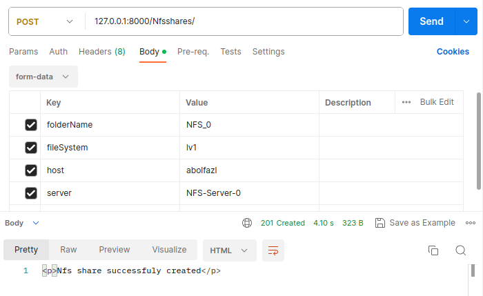
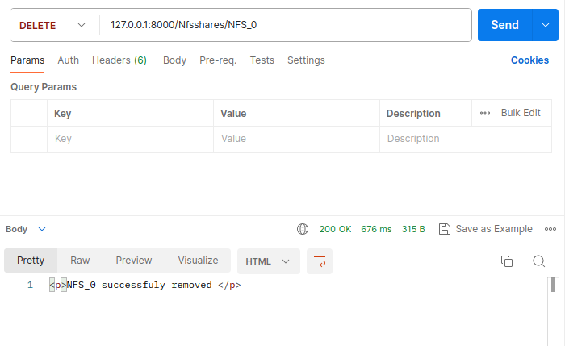

# What is the project
This project is for people who whant to share a directory or file with other people over a network easily.
it will help you from **mapping physical block devices** to **sharing** it.
The overall structure of the project is very easy.
### first step is  **POOL**
At first you have to start by creating a pool.
You can also create a pool by having any empty unpartitioned disk, anyway , pool is a space on which you can place your file systems.

### second step is **FILESYSTEM**
The second step is creating file system on your pool, file system is for separating data ,Without a file system, data placed in a storage medium would be one large body of data with no way to tell where one piece of data stopped and the next began, or where any piece of data was located when it was time to retrieve it ,for this reason file system is a space where you can put directorys or files that you want to share.

### third step is **Host**
In this step , you need to specify the people you want to share your files with.You do this with their IP addresses.

### last step is **SHARE**
For last step you have to create **NFS** share or **SMB**.

# Compatibility
This project have to run on **ubuntu** also as a **root user**.

# Installations

1. asgiref==3.7.2
2. Django==4.2.4
3. sqlparse==0.4.4
4. typing_extensions==4.7.1

# Api's

1. ### POOL API's

    - ##### /Polls 
        it will show you all your pools detail.
        

    - ##### /Pools/  
        it will open a new page for you to create a new pool.
        

    - ##### /Pools/<pool name> 
        this api remvoe the pool you want.
        
        
        

2. ### FILE SYSTEM API's
    - ##### /Filesystems 
        it will show you all your file systems detail.
        

    - ##### /Filesystems/  
        it will open a new page for you to create a new file system.
        

    - ##### /Filesystems/<filesystem name>  
        this api remvoe the pool you want.
        

3. ### HOST API's
    - ##### /Hosts 
        it will show you all your hosts details.
        

    - ##### /Hosts/  
        it will open a new page for you to create a new host.you can set ip address with netmask or single ip.
        **single ip**
        

        **range ip**
        

    - ##### /Host/<host name>  
        this api remvoe the pool you want.
        

4. ### NFS SHARE API's
    - ##### /NfsShares 
        it will show you all your nfs shares details.
        

    - ##### /NfsShares/  
        it will open a new page for you to create a new nfs share.
        
        
    - ##### /NfsShares/<nfs share name>  
        this api remvoe the pool you want.
        

